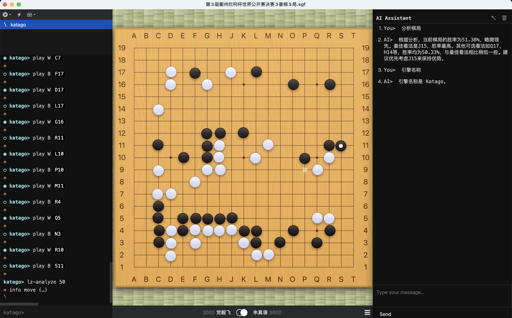
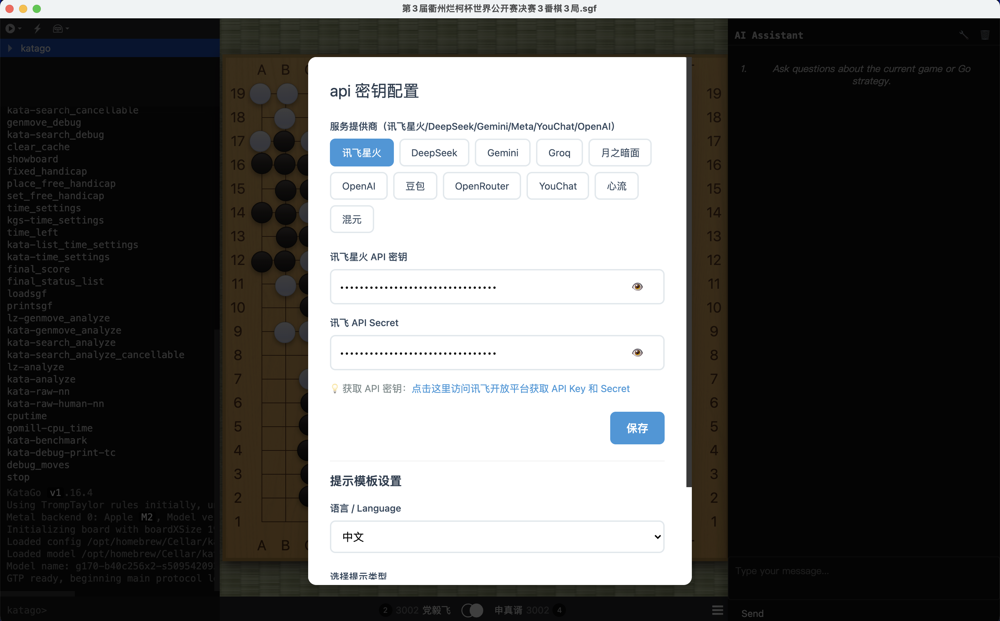

# 

## Core AI Agent Features

This project is built on the Sabaki Go interface, with a focus on integrating
advanced AI features to create an intelligent Go assistant:

### MCP (Model Context Protocol) Integration

- Serves as a standardized communication bridge between LLMs and professional
  tools
- Enables seamless collaboration between large language models and the KataGo Go
  engine
- Provides a secure, efficient framework for cross-system information sharing

### LLM (Large Language Model) Capabilities

- Interact with Go AI through natural language
- Get detailed explanations of Go positions and moves
- Ask questions about strategy, tactics, and Go principles
- Request specific board region analysis using natural language
- Persistent conversation history with up/down arrow key navigation for quick
  access to previous questions

### KataGo Professional Analysis

- Combines LLM's natural language understanding with KataGo's professional Go
  analysis capabilities
- Provides precise move recommendations and win rate analysis
- Executes corresponding analysis through MCP protocol based on LLM-processed
  user requests

### Intelligent Agent Architecture

- LLMs act as the "brain" responsible for understanding questions and generating
  natural language answers
- KataGo serves as a "professional skill extension" providing precise domain
  analysis
- MCP as a communication protocol enables efficient collaboration between the
  two
- Delivers both professional and easily understandable Go analysis experience
  for users

## Project Description

This project is an intelligent Go assistant developed based on the Sabaki Go
interface, focusing on integrating advanced AI technology with Go analysis.
Through the MCP protocol, we have achieved seamless collaboration between LLMs
and KataGo, providing users with a more intelligent and intuitive Go analysis
experience.

## License

This project is licensed under the MIT license.

---

[中文版本 (Chinese Version)](README.md)
